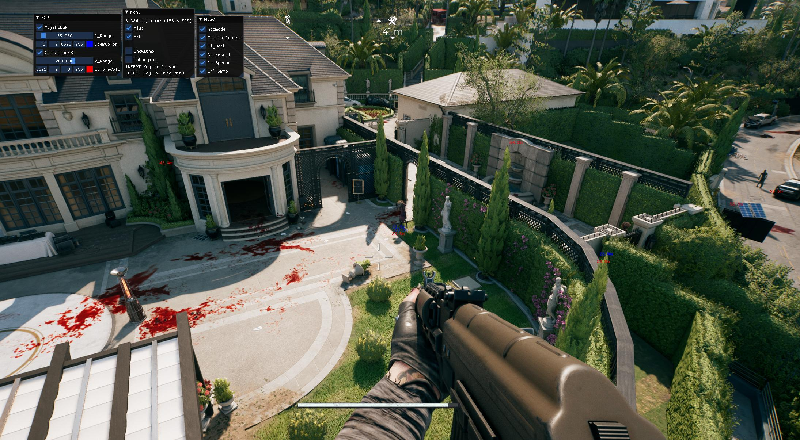

# Dead Island 2 External Cheat

Ein leichter, externer Overlay-Trainer für **Dead Island 2**, der über DirectX 11 und ImGui eine einfache Cheat-UI ins Spiel zeichnet.

POINTER SIND NICHT UPDATED!

## Features

- **DirectX 11 ImGui Overlay**  
  Blendet ein In-Game-Overlay ein, ohne das Spiel oder dessen Speicher direkt zu patchen.
- **Basic Cheat-Optionen**  
  – Unendlich Gesundheit  
  – Unendlich Ausdauer  
  – Unendlich Munition  
  – Keine Abklingzeiten  
- **Modularer Aufbau**  
  Die Cheat-Logik ist in leicht verständlichen Übersichts- und Helper-Klassen organisiert (z. B. `Helper.h`, `Debugging.h`).
- **GLM-Mathematik-Bibliothek**  
  Vektor- und Matrix-Rechenoperationen über die eingebundene GLM-Bibliothek.
- **MIT-Lizenz**  
  Offener Quellcode, frei adaptierbar und wiederverwendbar.

## Anforderungen

- **Betriebssystem**: Windows 10/11  
- **Spiel**: Dead Island 2 (Steam oder Epic)  
- **Entwicklungsumgebung**: Visual Studio 2019 oder neuer  
- **Abhängigkeiten**:  
  - DirectX 11 SDK (wird meist mit Windows SDK mitinstalliert)  
  - ImGui (im Repo enthalten)  
  - GLM (im Repo enthalten)  

## Installation & Build

1. **Repository klonen**  
   ```bash
   git clone https://github.com/VitaminStack/Dead-Island-2-External-Cheat.git
   cd Dead-Island-2-External-Cheat
   ```
2. **Projektdatei öffnen**  
   Öffne `DX11ImGuiOverlay.sln` in Visual Studio.
3. **Konfiguration wählen**  
   Wähle **Release** (für beste Performance) oder **Debug** (für eigene Experimente).
4. **Build ausführen**  
   Baue die Lösung (`Build → Build Solution`).
5. **DLL injizieren / starten**  
   - Kopiere die erzeugte `DX11ImGuiOverlay.dll` in dein Dead Island 2 Installationsverzeichnis.  
   - Starte das Spiel und injiziere die DLL per beliebigem Injector (z. B. `Winject`, `Extreme Injector`).

## Nutzung

- **Overlay aktivieren**: Beim Spielstart erscheint automatisch ein kleines Menü am oberen Bildschirmrand.  
- **Hotkeys**:  
  - `F1` – Overlay Ein/Aus  
  - `Num 1` – Gesundheit toggeln  
  - `Num 2` – Ausdauer toggeln  
  - `Num 3` – Munition toggeln  
  - `Num 4` – Abklingzeiten toggeln  
- **Anpassen**: Die Hotkeys und weiteren Einstellungen findest du in `main.cpp` und kannst sie nach Belieben ändern.

## Mitmachen & Feedback

Beiträge, Bug-Meldungen oder Verbesserungsvorschläge sind jederzeit willkommen:

1. Fork das Repository  
2. Erstelle einen neuen Branch (`git checkout -b feature/meine-idee`)  
3. Commit deine Änderungen (`git commit -am 'Add neat feature'`)  
4. Push zu deiner Fork (`git push origin feature/meine-idee`)  
5. Öffne einen Pull Request

## Haftungsausschluss

**Nur zu Bildungs- und Testzwecken!**  
Der Einsatz von Cheats kann gegen die Nutzungsbedingungen von Dead Island 2 verstoßen und zu einem Bann führen. Benutze diese Software daher ausschließlich in _Offline-Singleplayer_–Sitzungen und auf eigene Verantwortung.

---

© 2025 VitaminStack – MIT-Lizenz



